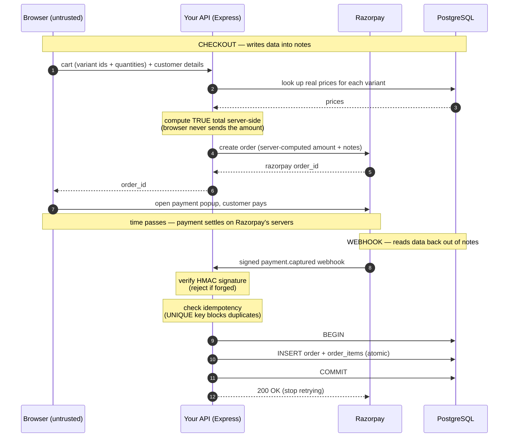

# Payment Flow — Melody Home

This diagram shows the full checkout and payment pipeline: how a customer's
order goes from browser to a confirmed row in the database.

The flow has two halves that meet at one point — the Razorpay order's `notes`
field. **Checkout** writes customer and item data *into* `notes`; the
**webhook** reads it back *out*. Checkout is the mirror image of the webhook.

Two principles are load-bearing:

1. **The server computes the price, never the browser.** The frontend sends
   *which* items and *how many*; the API looks up real prices from the database
   and computes the true total. The browser is under the customer's control, so
   it can never be trusted with the amount.

2. **The signed webhook is the source of truth, not the browser.** The browser
   finishing the payment popup is a UX nicety. The order only becomes *real*
   when Razorpay sends a signed `payment.captured` webhook that passes HMAC
   verification — because that signature is unforgeable.

## Key guarantees

- **Signature verification** — every webhook is verified with HMAC-SHA256 over
  the raw request body. A forged request is rejected before any processing.
- **Idempotency** — the Razorpay `order_id` is stored as a `UNIQUE`
  `idempotency_key`. Duplicate webhook deliveries (Razorpay uses at-least-once
  delivery) are safely ignored — one payment produces exactly one order.
- **Atomicity** — the order and all its line items are written inside a single
  transaction. A partial failure rolls back completely; no half-written orders.